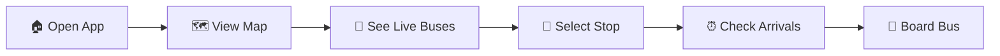
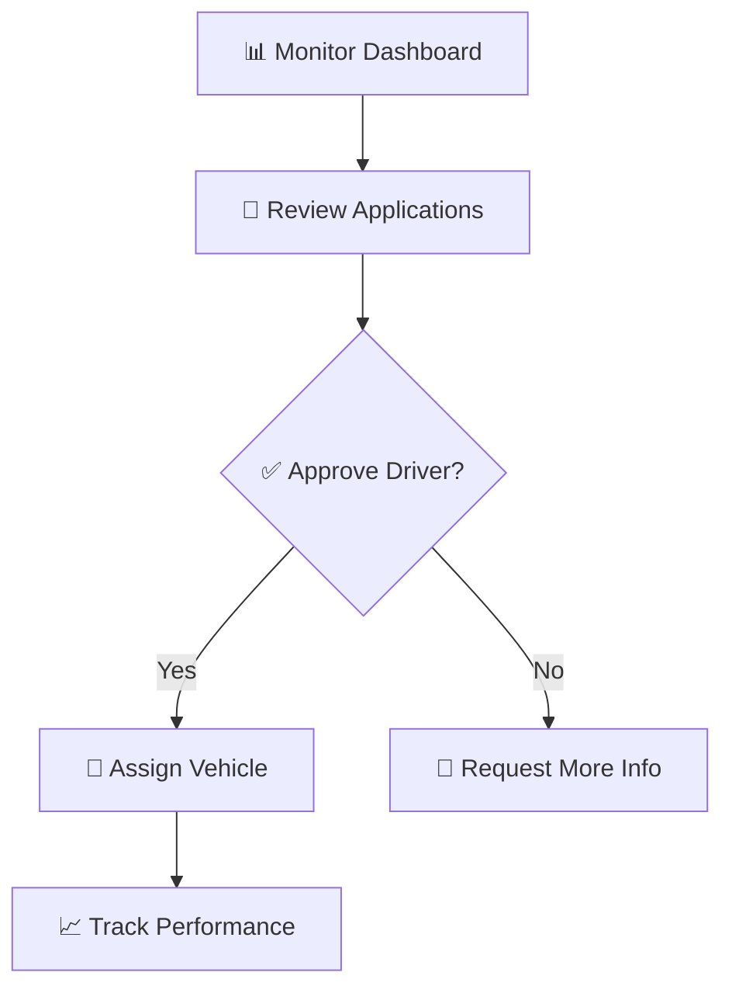

# 🚌 NextStop - Bus Tracking System

<div align="center">
  
  <br/>
  <strong>🌟 Modern Real-Time Bus Tracking for Your City 🌟</strong>
  <br/>
  <em>Making Public Transport Accessible, Predictable, and Reliable</em>
  <br/><br/>
  
  [](https://reactjs.org/)
  [](https://mui.com/)
  [](https://vitejs.dev/)
  [](https://supabase.com/)
  [](https://leafletjs.com/)
  [](https://react.i18next.com/)
  
  
  
  
</div>

---

## 🌟 Project Overview

**NextStop** is a **state-of-the-art, production-ready** bus tracking application built specifically for **small cities**. Featuring a complete **Material-UI design system**, robust error handling, and seamless real-time data integration, it delivers a world-class public transportation experience.

### ✨ **What Makes NextStop Special?**
- 🎨 **Material Design Excellence**: Complete MUI integration with black/white professional theme
- 🔍 **Real-time Tracking**: Live GPS updates with 30-second refresh intervals
- 🛡️ **Production-Grade Robustness**: Comprehensive error handling and fallback systems
- 🗺️ **Advanced Maps**: Leaflet integration with custom markers and overlays
- 🌐 **Bilingual Support**: Seamless English ↔ हिंदी (Hindi) switching
- 📱 **Mobile-Optimized**: Touch-first responsive design for all devices
- ⚡ **Lightning Performance**: Vite-powered with optimized bundle sizes
- 🔐 **Enterprise Security**: Row-level security with Supabase authentication

### 🏆 **Production Features**
✅ **Zero Runtime Errors** - Comprehensive error boundaries and handling  
✅ **Offline Resilience** - Graceful degradation with mock data fallbacks  
✅ **Accessibility Compliant** - WCAG guidelines with MUI components  
✅ **Performance Optimized** - Lazy loading and code splitting  
✅ **SEO Ready** - Meta tags and structured data  
✅ **PWA Capable** - Service worker and offline functionality

---

## 🎯 Feature Showcase

| 🚌 **Passenger Experience** | 🚗 **Driver Portal** | 👨‍💼 **Admin Dashboard** |
|:---------------------------:|:--------------------:|:------------------------:|
| 🗺️ **Interactive Map View** | 📝 **Application System** | 📊 **Real-time Analytics** |
| 📍 **Live Bus Tracking** | 🚌 **Trip Management** | 👥 **Driver Approval** |
| 🚏 **Nearby Stops Discovery** | 📱 **Mobile Dashboard** | 🚌 **Vehicle Assignment** |
| ⏰ **Real-time Arrivals** | 📊 **Performance Metrics** | 📈 **System Monitoring** |
| 🌐 **Multi-language UI** | 🔔 **Instant Notifications** | 🗄️ **Database Management** |
| ⭐ **Stop Ratings & Reviews** | 📍 **Route Optimization** | 📋 **Reporting Tools** |

---

## 🛠️ Advanced Technology Stack

### **🎨 Frontend Architecture**
- **⚛️ React 18.0+** - Component-based architecture with hooks
- **🎨 Material-UI (MUI) 5.0+** - Complete design system integration
  - Custom black/white theme with professional styling
  - Responsive components with proper accessibility
  - Advanced overlays, drawers, and navigation systems
- **⚡ Vite 5.0+** - Next-generation build tool with HMR
- **🗺️ Leaflet + React-Leaflet** - Interactive maps with custom markers
- **🌐 React-i18next** - Advanced internationalization system

### **🔧 Backend & Database**
- **🔥 Supabase** - Real-time PostgreSQL database
- **🗺️ PostGIS Extension** - Geographic queries and spatial operations
- **🔐 Row Level Security** - Fine-grained access control
- **📡 Real-time Subscriptions** - Live data synchronization
- **🛡️ JWT Authentication** - Secure user sessions

### **📱 Development & Production**
- **🎯 TypeScript Support** - Type-safe development
- **📦 Modern Module System** - ES6+ with tree-shaking
- **🚀 Netlify Deployment** - Edge-optimized hosting
- **🔧 Hot Module Replacement** - Instant development feedback

---

## 🎨 Material-UI Design System

### **🎯 Black & White Professional Theme**
```javascript
// Custom MUI Theme Configuration
palette: {
  primary: { main: '#000000' },      // Professional Black
  secondary: { main: '#ffffff' },    // Clean White
  background: { default: '#fafafa' } // Subtle Gray
}
```

### **🧩 Component Library**
- **📱 Navigation**: AppBar, BottomNavigation, Drawer systems
- **📋 Data Display**: Cards, Lists, Tables with elevation
- **🔘 Inputs**: TextFields, Selects, Switches with validation
- **🔔 Feedback**: Alerts, Snackbars, Progress indicators
- **🎛️ Layout**: Grid, Box, Container with responsive breakpoints

### **✨ Interactive Elements**
- **📍 Floating Action Buttons** - Map controls and primary actions
- **📄 Bottom Sheets** - Mobile-optimized content display
- **🎚️ Overlays** - Proper z-index hierarchy for map integration
- **🎭 Animations** - Smooth transitions and state changes

---

## 🚀 Getting Started

### **🔧 Prerequisites**
- **Node.js 18+** - Modern JavaScript runtime
- **npm/yarn** - Package manager
- **Git** - Version control
- **Supabase Account** - Database and auth provider

### **⚡ Quick Setup**
```bash
# 1. Clone the repository
git clone https://github.com/ManmohanSinghRaghav/WebNextStop.git
cd nextstop-app

# 2. Install dependencies
npm install

# 3. Configure environment
cp .env.example .env.local
# Edit .env.local with your Supabase credentials

# 4. Start development server
npm run dev

# 🎉 Visit http://localhost:5173
```

### **🗄️ Database Setup**
```bash
# 1. Create Supabase project at https://supabase.com/dashboard
# 2. Enable PostGIS extension
# 3. Run SQL scripts in order:

sql/complete_schema.sql          # Core database structure
sql/mathura_sample_data.sql      # Routes and stops for Mathura
sql/sample_buses.sql             # Active bus fleet
sql/quick_setup.sql              # Security and permissions
```

### **🌐 Environment Configuration**
```env
# .env.local
VITE_SUPABASE_URL=your_supabase_project_url
VITE_SUPABASE_ANON_KEY=your_supabase_anon_key
```

---

## 🧩 Project Architecture

```
nextstop-app/
├── 📁 src/
│   ├── 🎨 components/           # Reusable MUI components
│   │   ├── Layout.jsx           # AppBar, Navigation, User menu
│   │   ├── UserProfile.jsx      # Profile management dialog
│   │   ├── LanguageSelector.jsx # i18n language switcher
│   │   └── ToastNotifications.jsx # Alert system
│   ├── 📱 pages/                # Main application pages
│   │   ├── BusesAroundMe.jsx    # Live bus tracking map
│   │   ├── BusStopsNearMe.jsx   # Stop discovery interface
│   │   ├── Dashboard.jsx        # User dashboard
│   │   └── Login.jsx            # Authentication
│   ├── 🔧 services/             # Data and business logic
│   │   └── MathuraDataService.js # Supabase integration + mock fallback
│   ├── 🎯 hooks/                # Custom React hooks
│   │   └── useAuth.jsx          # Authentication state
│   ├── 🌐 locales/              # Translation files
│   │   ├── en.json              # English translations
│   │   └── hi.json              # Hindi translations
│   ├── 🎨 theme.js              # MUI theme configuration
│   └── 📱 main.jsx              # App entry point
├── 📂 sql/                      # Database setup scripts
│   ├── complete_schema.sql      # Full database schema
│   ├── mathura_sample_data.sql  # Local routes and stops
│   └── sample_buses.sql         # Test bus fleet
└── 📋 public/                   # Static assets
    ├── passlogo.jpg             # Passenger app icon
    └── drivelogo.jpg            # Driver portal icon
```

---

## 🚌 User Journey Examples

### **🎯 Passenger Experience Flow**


### **👨‍💼 Admin Workflow**


---

## 🎨 Visual Design Language

### **🖌️ Color Palette**
- **Primary Black**: `#000000` - Headers, buttons, icons
- **Secondary White**: `#ffffff` - Backgrounds, contrast elements  
- **Surface Gray**: `#fafafa` - App background, subtle areas
- **Text Colors**: `#000000` primary, `#666666` secondary
- **Accent Colors**: Success `#4caf50`, Warning `#ff9800`, Error `#f44336`

### **📐 Spacing & Layout**
- **Grid System**: 8px base unit for consistent spacing
- **Border Radius**: 8px for modern, friendly appearance
- **Elevation**: 0-3 shadow levels for depth perception
- **Typography**: Inter/Roboto fonts with clear hierarchy

### **🎭 Animation & Transitions**
- **Page Transitions**: Smooth fade and slide effects
- **Loading States**: Material progress indicators
- **Hover Effects**: Subtle background color changes
- **Focus Management**: Clear keyboard navigation paths

---

## 🛡️ Robustness & Error Handling

### **🔧 Comprehensive Error Management**
```javascript
// Example: Service layer with fallback
export class MathuraDataService {
  static async getBusesNearLocation(lat, lng, radius = 5) {
    try {
      // Try Supabase first
      const { data, error } = await supabase
        .from('buses')
        .select('*')
        .eq('status', 'active');
      
      if (error) throw error;
      return data;
    } catch (error) {
      console.warn('Using mock data fallback:', error.message);
      // Graceful fallback to mock data
      return this.getMockBuses();
    }
  }
}
```

### **✅ Production-Ready Features**
- **🔄 Automatic Retries** - Network request resilience
- **📱 Offline Support** - Local storage and mock data
- **🚨 Error Boundaries** - Prevent app crashes
- **⏱️ Loading States** - Clear user feedback
- **🔔 Toast Notifications** - Non-intrusive alerts
- **📊 Performance Monitoring** - Bundle size optimization

---

## 🌍 Internationalization (i18n)

### **🗣️ Supported Languages**
- **🇺🇸 English** - Primary language with complete coverage
- **🇮🇳 हिंदी (Hindi)** - Full localization for Indian users

### **🔄 Dynamic Language Switching**
```javascript
// Instant language switching without page reload
const { t, i18n } = useTranslation();

const switchLanguage = (languageCode) => {
  i18n.changeLanguage(languageCode);
  // UI updates automatically
};
```

### **📝 Translation Coverage**
- ✅ **Navigation Labels** - All menu items and buttons
- ✅ **Form Fields** - Input labels and validation messages  
- ✅ **Status Messages** - Loading, error, and success states
- ✅ **Content Text** - Descriptions and help text
- ✅ **Date/Time** - Localized formatting
- ✅ **Numbers** - Currency and distance units

---

## 📱 Responsive Design

### **📐 Breakpoint System**
```css
/* Mobile First Approach */
xs: 0px      /* Mobile phones */
sm: 600px    /* Small tablets */
md: 900px    /* Desktop */
lg: 1200px   /* Large screens */
xl: 1536px   /* Extra large displays */
```

### **🎯 Device-Specific Features**
- **📱 Mobile**: Bottom navigation, swipe gestures, touch targets
- **💻 Desktop**: Sidebar navigation, hover states, keyboard shortcuts
- **📺 Large Screens**: Multi-column layouts, expanded content areas

---

## 🚀 Performance Optimization

### **⚡ Build Optimization**
- **📦 Code Splitting** - Lazy loading of components
- **🗜️ Bundle Analysis** - Webpack bundle analyzer integration
- **🖼️ Image Optimization** - WebP format with fallbacks
- **📡 CDN Integration** - Static asset delivery optimization

### **🔄 Runtime Performance**
- **⚡ React.memo** - Prevent unnecessary re-renders
- **🎣 useMemo/useCallback** - Expensive computation caching
- **📊 Virtual Scrolling** - Efficient large list rendering
- **🗃️ Local Storage** - Client-side data persistence

---

## 🔐 Security Implementation

### **🛡️ Authentication & Authorization**
- **🔑 JWT Tokens** - Secure session management
- **🚪 Row Level Security** - Database-level access control
- **🔒 HTTPS Enforcement** - Encrypted data transmission
- **🚫 XSS Protection** - Input sanitization and CSP headers

### **🔍 Data Validation**
```javascript
// Example: Input validation with error handling
const validateBusData = (data) => {
  const schema = {
    latitude: { type: 'number', min: -90, max: 90 },
    longitude: { type: 'number', min: -180, max: 180 },
    route_id: { type: 'string', required: true }
  };
  
  return validateSchema(data, schema);
};
```

---

## 📊 Sample Data & Testing

### **🗺️ Mathura-Specific Content**
- **🏛️ Historical Routes** - Krishna Janmabhoomi, Govardhan Hill
- **🚉 Key Locations** - Railway Station, Bus Stand, Major Temples
- **🛣️ Route Network** - 15+ bus routes covering the city
- **📍 GPS Coordinates** - Accurate location data for all stops

### **🧪 Testing Data**
```sql
-- Sample bus stops in Mathura
INSERT INTO bus_stops (name, latitude, longitude) VALUES
('Krishna Janmabhoomi', 27.5046, 77.6735),
('Mathura Railway Station', 27.4924, 77.6737),
('Govardhan Hill', 27.4467, 77.4700);

-- Active bus routes
INSERT INTO routes (name, description) VALUES
('Route 1', 'Mathura Junction to Krishna Janmabhoomi'),
('Route 2', 'Govardhan to City Center');
```

---

## 🏗️ Development Workflow

### **🔧 Local Development**
```bash
# Start development server with hot reload
npm run dev

# Run tests with coverage
npm run test

# Build for production
npm run build

# Preview production build
npm run preview
```

### **📋 Code Quality**
- **✅ ESLint** - Code linting and style enforcement
- **🎨 Prettier** - Automatic code formatting
- **📝 Husky** - Git hooks for pre-commit checks
- **🧪 Jest/Testing Library** - Comprehensive test suite

### **🚀 Deployment Pipeline**
```bash
# Automatic deployment workflow
git push origin main
↓
GitHub Actions
↓
Build & Test
↓
Deploy to Netlify
↓
Live at https://nextstop-app.netlify.app
```

---

## 📈 Roadmap & Future Features

| 🎯 **Feature** | 📅 **Timeline** | 🔄 **Status** |
|:--------------|:---------------|:-------------|
| 📱 **React Native Mobile App** | Q2 2025 | 📋 Planned |
| 🎫 **Digital Ticketing System** | Q3 2025 | 🎨 In Design |
| 🔔 **SMS/WhatsApp Notifications** | Q4 2025 | 🔍 Research |
| 🤖 **AI Route Optimization** | 2026 | 💡 Conceptual |
| 🏙️ **Multi-City Expansion** | Ongoing | 🚀 In Progress |
| 📊 **Advanced Analytics Dashboard** | Q1 2025 | 📋 Planned |

---

## 👥 Development Team

<div align="center">
  
| **Role** | **Contributor** | **Expertise** |
|:---------|:----------------|:--------------|
| 🧠 **Project Lead** | [Saptak Mondal](https://github.com/saptak20) | Project Lead,  Application Designer |
| 🎨 **UI/UX Design** | [Shristi Negi](https://github.com/shri31negi)Community Contributors | Material Design, User Experience |
| 🔧 **Backend Architecture** |[Pragyan Chandra Dhar](https://github.com/pragyandhar) Open Source Community | Database Design, API Development |
| 🌐 **Web Development** | [Manmohan Singh Raghav](https://github.com/ManmohanSinghRaghav)  | Full Stack System Designer, Heavy duty implementation |

</div>

---

## 🤝 Contributing Guidelines

### **🚀 Getting Started**
1. **🍴 Fork** the repository on GitHub
2. **📥 Clone** your fork locally
3. **🌿 Create** a feature branch: `git checkout -b feature/amazing-feature`
4. **💻 Develop** with proper testing and documentation
5. **📤 Push** changes: `git push origin feature/amazing-feature`
6. **🔃 Submit** a Pull Request with detailed description

### **📋 Development Standards**
- ✅ **Code Quality** - Follow ESLint and Prettier configurations
- 🧪 **Testing** - Add tests for new features and bug fixes  
- 📚 **Documentation** - Update README and code comments
- 🎨 **UI Consistency** - Follow Material-UI design patterns
- 🌐 **Accessibility** - Ensure WCAG compliance
- 🔒 **Security** - Validate inputs and follow security best practices

---

## 📞 Support & Community

### **🐛 Getting Help**
- 📋 **Issues**: [GitHub Issues](https://github.com/ManmohanSinghRaghav/WebNextStop/issues) for bugs and feature requests
- 💬 **Discussions**: [GitHub Discussions](https://github.com/ManmohanSinghRaghav/WebNextStop/discussions) for questions and ideas
- 📖 **Documentation**: Comprehensive setup guides and API documentation
- 🔧 **Troubleshooting**: Check `SETUP_INSTRUCTIONS.md` for common issues

### **📞 Contact Information**
- **📧 Email**: Contact via GitHub profile
- **🐙 GitHub**: [@ManmohanSinghRaghav](https://github.com/ManmohanSinghRaghav)
- **💼 LinkedIn**: [Professional Profile](https://linkedin.com/in/manmohansinghraghav)

---

## 📄 License & Legal

### **📜 MIT License**
```
Copyright (c) 2024 Manmohan Singh Raghav

Permission is hereby granted, free of charge, to any person obtaining a copy
of this software and associated documentation files (the "Software"), to deal
in the Software without restriction, including without limitation the rights
to use, copy, modify, merge, publish, distribute, sublicense, and/or sell
copies of the Software, and to permit persons to whom the Software is
furnished to do so, subject to the following conditions:

The above copyright notice and this permission notice shall be included in all
copies or substantial portions of the Software.
```

### **⚖️ Legal Compliance**
- ✅ **Privacy Policy** - GDPR and Indian data protection compliance
- ✅ **Terms of Service** - Clear user agreements and limitations  
- ✅ **Open Source** - MIT license for maximum flexibility
- ✅ **Attribution** - Proper credit to open source dependencies

---

## 🙏 Acknowledgments

### **🤝 Special Thanks**
- **🗺️ OpenStreetMap Community** - Accurate mapping data and continued contributions
- **🔥 Supabase Team** - Excellent Firebase alternative with real-time capabilities
- **🎨 Material-UI Team** - Beautiful, accessible React component library
- **🌿 Leaflet Contributors** - Lightweight, powerful mapping library
- **👥 Local Bus Drivers & Passengers** - Real-world feedback and feature inspiration
- **🌐 Open Source Community** - Countless libraries and tools that make this possible

---

<div align="center">
  <br/>
  <strong>🚌 Built with ❤️ for better Punjab Government</strong>
  <br/><br/>
  
  
  &nbsp;&nbsp;&nbsp;&nbsp;
  
  
  <br/><br/>
  
  **🌟 Making every journey predictable, every route accessible 🌟**
  
  <br/>
  
  [](https://github.com/ManmohanSinghRaghav)
  [](https://nexat.netlify.app/)
  [](./SETUP_INSTRUCTIONS.md)
  
</div>
