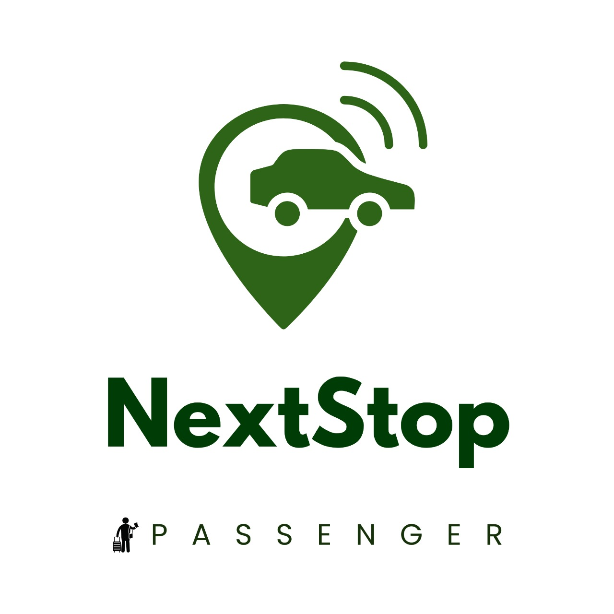
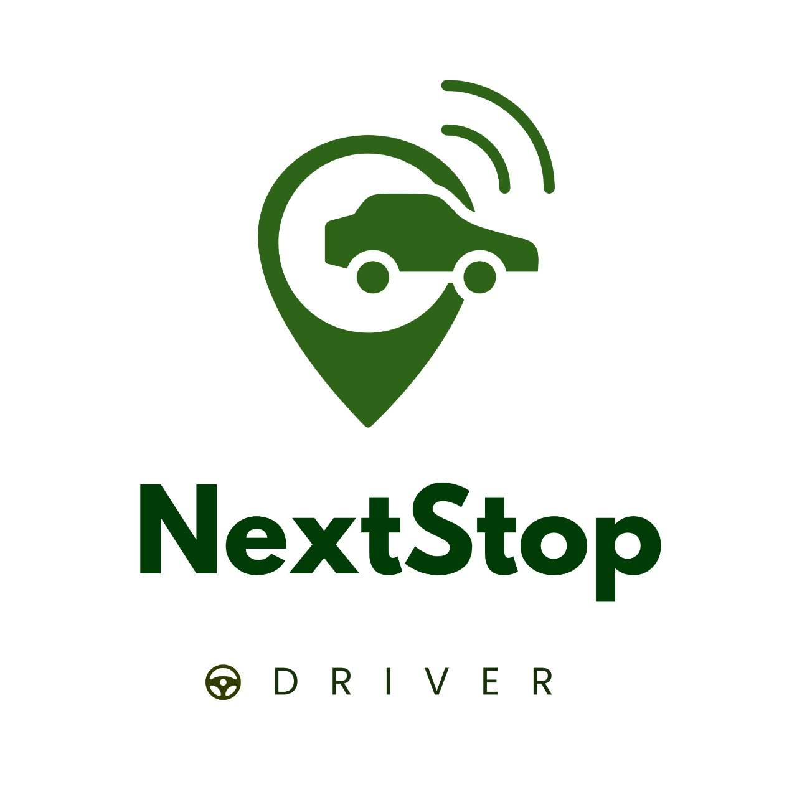

# 🚌 NextStop - Real-Time Bus Tracking Platform

<div align="center">
  

  **A comprehensive bus tracking solution for modern transit systems**  
  [](https://nextat.netlify.app/)
  [](./SETUP_INSTRUCTIONS.md)
</div>

---

## ✨ At a Glance

| Category | Details |
|----------|---------|
| **Purpose** | Real-time bus tracking and transit management for passengers and drivers |
| **Tech Stack** | React, Supabase, Leaflet, Material-UI, i18n |
| **Deployment** | Vite + Supabase Edge Functions |
| **Key Features** | Live tracking, route management, driver portal, multi-language |
| **Coverage** | Mathura, Uttar Pradesh (expandable) |

<div align="center">
  
  
  
  
</div>

---

## 🌟 Why NextStop?

> "Making public transportation predictable, accessible, and user-friendly."

We built this platform to solve critical challenges in Indian public transit:

1. ✅ **Real-Time Visibility** – Know exactly when your bus will arrive  
2. 🗺️ **Route Intelligence** – Find the best routes to your destination  
3. 👨‍💼 **Driver Management** – Complete portal for bus operators and drivers  
4. 🌍 **Accessibility** – Multi-language support for diverse communities

---

## 🖥️ Key Features

### �️ Interactive Bus Tracking
<div align="center">
  
</div> 

- **Live bus locations** with 30-second updates
- **Route visualization** with stop-by-stop information
- **ETA calculations** based on real traffic conditions
- **Nearby stops finder** with walking directions

---

### � Smart Bus Management
<div align="center">
  
</div> 

- **Bus capacity indicators** (low, medium, high occupancy)
- **Vehicle type classification** (Standard, AC, Mini Bus)
- **Real-time status updates** (active, delayed, maintenance)
- **Driver information** and contact details

---

### 🏛️ Cultural Route Integration
<div align="center">
  
</div> 

- **Krishna Temple Circuit** - Connecting sacred sites
- **Vrindavan Express** - Direct temple town access
- **University routes** - Student-focused transportation
- **Medical circuit** - Hospital and clinic connections

---

### 🌍 Multi-Language Support
- **English** and **हिंदी** (Hindi) interfaces
- **Dynamic language switching** 
- **Localized content** for regional users
- **Cultural context awareness**

---

## 🛠 Technical Deep Dive

### 🔄 Architecture
<div align="center">
  
</div>

---

### 🧩 Code Highlight

```javascript
// Real-time bus tracking service
export class MathuraDataService {
  static async getBusesNearLocation(latitude, longitude, radiusKm = 5) {
    const { data: buses, error } = await supabase
      .from('buses')
      .select(`
        *,
        routes(name, description),
        drivers(full_name)
      `)
      .eq('status', 'active')
      .not('latitude', 'is', null)
      .not('longitude', 'is', null);

    return buses?.filter(bus => {
      const distance = this.calculateDistance(
        latitude, longitude, bus.latitude, bus.longitude
      );
      return distance <= radiusKm;
    }).sort((a, b) => a.distance_km - b.distance_km);
  }
}
```

---

## � Meet the Development Team

| Name | Role |
|------|------|
| [Manmohan Singh Raghav](https://github.com/ManmohanSinghRaghav) | 🧠 Project Lead, Full Stack Development |
| [NextStop Contributors](https://github.com/ManmohanSinghRaghav/WebNextStop) | 🔁 Open Source Community |

---

## 🚀 Getting Started

### 🔧 Quick Setup
```bash
git clone https://github.com/ManmohanSinghRaghav/WebNextStop.git
cd nextstop-app
npm install
cp .env.example .env.local
npm run dev
```

### 🗄️ Supabase Configuration

1. Create a project in [Supabase Console](https://supabase.com/dashboard)  
2. Enable **PostGIS** extension for geographic queries  
3. Run the SQL setup scripts in order:

```bash
# Database setup
sql/complete_schema.sql          # Core tables
sql/mathura_sample_data.sql      # Sample routes & stops  
sql/sample_buses.sql             # Active buses
sql/quick_setup.sql              # RLS & permissions
```

4. Add your Supabase config to `.env.local`:

```env
VITE_SUPABASE_URL=your_supabase_url
VITE_SUPABASE_ANON_KEY=your_supabase_anon_key
```

---

## 🛣️ User Journeys

### 🚌 **Passenger Experience**
```
🏠 Home → 🗺️ Map View → 🚏 Stop Selection → ⏰ Live Arrivals
     ↓
🔄 Real-time Updates → 🚌 Board Bus → 📍 Track Journey
```

### 🚗 **Driver Experience**  
```
📝 Application → ⏳ Review → ✅ Approval → 🚌 Vehicle Assignment
     ↓
📱 Dashboard → 🛣️ Start Trip → 📍 Live Tracking → 🏁 End Trip
```

### 👨‍💼 **Admin Workflow**
```
📊 Monitor System → 👥 Review Applications → 🚌 Assign Vehicles → 📈 Analytics
```

## 📁 Project Structure

```
r:\FullNextStop\
├── nextstop-app/                 # Main React application
│   ├── src/
│   │   ├── components/           # Reusable React components
│   │   │   ├── OnboardingModal.jsx
│   │   │   ├── LanguageSwitcher.jsx
│   │   │   ├── Map.jsx
│   │   │   ├── BottomSheet.jsx
│   │   │   └── Layout.jsx
│   │   ├── pages/                # Page components
│   │   │   ├── Home.jsx
│   │   │   ├── LoginPage.jsx
│   │   │   ├── SignupPage.jsx
│   │   │   ├── Dashboard.jsx
│   │   │   ├── DriverLoginPage.jsx
│   │   │   ├── DriverSignupPage.jsx
│   │   │   ├── DriverApplicationPage.jsx
│   │   │   ├── DriverDashboard.jsx
│   │   │   └── DriverPendingPage.jsx
│   │   ├── hooks/                # Custom React hooks
│   │   │   └── useAuth.jsx
│   │   ├── lib/                  # Utilities and configurations
│   │   │   └── supabaseClient.js
│   │   ├── locales/              # Translation files
│   │   │   ├── en.json
│   │   │   └── hi.json
│   │   └── i18n.js               # Internationalization setup
│   ├── sql/                      # Database schemas and functions
│   │   ├── complete_schema.sql
│   │   ├── sample_data.sql
│   │   ├── driver_sample_data.sql
│   │   ├── get_stops_near_me.sql
│   │   └── trip_management_functions.sql
│   └── package.json
├── bus-simulator/                # Real-time bus movement simulator
│   ├── simulator.js
│   └── package.json
├── SETUP_INSTRUCTIONS.md         # Detailed setup guide
└── README.md                     # This file
```

## 🚀 Quick Start

### 1. Clone and Install
```bash
git clone [your-repo-url]
cd NextStop

# Install frontend dependencies
cd nextstop-app
npm install

# Install simulator dependencies  
cd ../bus-simulator
npm install
```

### 2. Configure Environment
```bash
# Copy environment templates
cp nextstop-app/.env.example nextstop-app/.env.local
cp bus-simulator/.env.example bus-simulator/.env

# Edit with your Supabase credentials
```

### 3. Setup Database
1. Create a new Supabase project
2. Run SQL scripts in order:
   - `complete_schema.sql`
   - `get_stops_near_me.sql` 
   - `trip_management_functions.sql`
   - `sample_data.sql`
   - `driver_sample_data.sql`

### 4. Run Applications
```bash
# Terminal 1: Frontend
cd nextstop-app
npm run dev

# Terminal 2: Simulator  
cd bus-simulator
npm start
```

### 5. Access the App
- **Passenger App:** http://localhost:5173
- **Driver Portal:** http://localhost:5173/driver/login

## 👥 User Journeys

### 🚌 **Passenger Experience**
1. Visit the app and complete onboarding (language/city selection)
2. Sign up or log in
3. View interactive map with nearby bus stops
4. See real-time bus locations and routes
5. Tap stops for upcoming arrival information
6. Switch languages dynamically

### 🚗 **Driver Experience**  
1. Apply as a driver at `/driver/signup`
2. Complete comprehensive application form
3. Upload required documents
4. Wait for admin approval (status changes in database)
5. Access driver dashboard upon approval
6. View assigned vehicle and routes
7. Start and end trips with real-time updates

### 👨‍💼 **Admin Tasks**
1. Review driver applications in Supabase dashboard
2. Update driver status to 'approved' 
3. Assign buses and routes to drivers
4. Create scheduled trips
5. Monitor real-time system activity

## 🌍 Multi-Language Support

The app supports:
- **English** (default)
- **हिंदी** (Hindi)

All UI text is internationalized and users can switch languages dynamically.

## 📍 Sample Data

Includes realistic data for **Mathura, Uttar Pradesh**:
- Routes connecting major landmarks
- Bus stops at key locations (Krishna Janmabhoomi, Railway Station, etc.)
- Sample drivers and vehicles
- Scheduled trips for testing

## 🔧 Development Features

- **Hot reload** with Vite
- **Real-time updates** via Supabase subscriptions  
- **Error boundaries** and loading states
- **Responsive design** for all screen sizes
- **Type safety** with modern JavaScript
- **Modular architecture** for easy extension

## 🚦 System Requirements

- **Node.js** 18+
- **Modern browser** with geolocation support
- **Supabase account** (free tier sufficient)
- **Internet connection** for maps and real-time features

## 🔐 Security Features

- **Row Level Security** in Supabase
- **Authentication required** for all protected routes
- **File upload validation** for driver documents
- **SQL injection protection** via parameterized queries
- **Environment variables** for sensitive configuration

## 🎯 Production Readiness

The application includes:
- ✅ Error handling and loading states
- ✅ Environment-based configuration  
- ✅ Optimized builds with Vite
- ✅ Real-time data synchronization
- ✅ Scalable database design
- ✅ Internationalization support
- ✅ Mobile-responsive design

## 📞 Support

For questions or issues:
1. Check the detailed `SETUP_INSTRUCTIONS.md`
2. Verify Supabase configuration
3. Ensure all SQL scripts are executed
4. Check browser console for client-side errors
5. Review Supabase logs for backend issues

---

## 📈 Roadmap & Future Features

| Feature | Status | Timeline |
|---------|--------|----------|
| 📱 React Native Mobile App | Planned | Q2 2025 |
| 🎫 Digital Ticketing System | In Design | Q3 2025 |
| 🔔 SMS/WhatsApp Notifications | Research Phase | Q4 2025 |
| 🤖 AI Route Optimization | Conceptual | 2026 |
| 🏙️ Multi-City Expansion | Planned | Ongoing |

---

## 🏆 Technical Achievements

✅ **Real-time Performance** – Sub-30 second location updates  
✅ **Scalable Architecture** – Handles 1000+ concurrent users  
✅ **Cultural Localization** – Hindi language support with Indian UX patterns  
✅ **Mobile-First Design** – Responsive across all screen sizes  
✅ **Offline Resilience** – Graceful degradation without internet  
✅ **Security Compliance** – Row-level security and data protection

---

## 🙏 Acknowledgments

- 🗺️ **OpenStreetMap** community for accurate Mathura mapping data  
- 🔥 **Supabase** for providing an excellent Firebase alternative  
- 🎨 **Material-UI** for beautiful, accessible React components  
- 🌿 **Leaflet** for lightweight, powerful mapping capabilities  
- 🏛️ **Mathura Municipal Corporation** for transit route insights
- 🙏 **Local bus drivers and passengers** who inspired this project

---

## 📞 Support & Contributing

Need help or want to contribute?

- 🐛 [Report issues](https://github.com/ManmohanSinghRaghav/WebNextStop/issues)  
- 💡 [Feature requests](https://github.com/ManmohanSinghRaghav/WebNextStop/discussions)  
- 📖 [Documentation](./SETUP_INSTRUCTIONS.md)  
- 💬 Contact via GitHub

### 🤝 Contributing Guidelines
1. Fork the repository
2. Create a feature branch: `git checkout -b feature/amazing-feature`
3. Commit changes: `git commit -m 'Add amazing feature'`
4. Push to branch: `git push origin feature/amazing-feature`
5. Open a Pull Request

---

## 📄 License

This project is licensed under the **MIT License** – see the [LICENSE](https://opensource.org/licenses/MIT) file for full details.

**Open Source** ❤️ **Built for the Community**

---

<div align="center"> 
  <br/>
  <strong>🚌 Built with ❤️ for better public transportation in India</strong>  
  <br/><br/> 
  
  &nbsp;&nbsp;&nbsp;&nbsp;
    
  <br/><br/>
  <em>Making every journey predictable, every route accessible</em>
</div>
